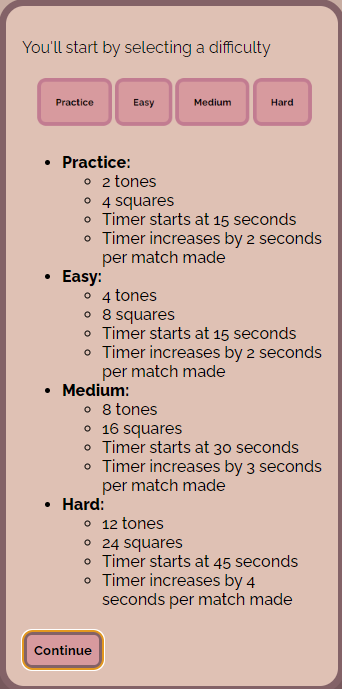
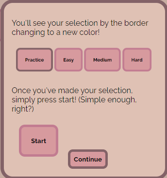

# Unison

## What is Unison

* Unison is a tonal, or sound, matching game. It forces the player to not look for matches but listen for the matches. 

* A challange for young and old alike! No matter what age you find yourself at tonal regoniztion can be a challenge. It is a lot harder to remember the location of sounds than it sounds (bah-dum-tss)

### That sounds cool and all, but why a music game?

* The purpose of the game itself is a fun introduction to ear training. Ear training is a necessecity for musicians, composers, conductors, you name it! 

* This game allows for a younger generation to not only play a game but learn while doing so, and not even know it.

### Yes, yes, I know. But why?

My background was and continues to be heavily impacted by music. 
1. I have a BA in music engineering
2. I play plenty of instruments (not all at once though)
3. I compose (or try too)

I even used to play in bands growing up! But that all being said, music has and will always be a part of me. And nothing beats putting something out there that shows that passion, in whatever unquie way it may end up in. 

Well with all of that said. without furtherado, I present you. **Unsion**.

## Getting Started: 

Link to **[Unison](https://sleeper9235.github.io/unison-concentration-game/)**

The instructions are more interative read in the game and recommend reading there.

### Instructions: 

 

links to draft materials:
1. [Pseudocode](assets/documents/Pseudocode.docx)
2. [Game draft](assets/documents/Game_proposal.docx)

## Technologies Used:

* HTML 
* JavaScript
* CSS
* Logic Pro (for creating and exporting the audio tones)
* Paint (for the images)
* Itunes (for converting the audio tones)

## Next Steps:

1. I would like to learn CSS grid and flexbox a little more and try to better set the objects for the easy and hard difficulty. Preferably to a more structured 3x3 and 5x5 in design but with the center missing instead of the final.

2. I would like to have better parameters and code for multiple devices 

3. I would like to flush out the code a little more, update from flex to grid. As well as make the win screen feel more rewarding.

4. I would like to make a "high score" board, that solely keeps track of the attempts made on the current interation of the game. (resets on refresh currently)

5. I would like to address any gramatical errors still present
